<div align="center">

# 🛡️ ImunoEdge

**Self-Healing IoT Runtime powered by [TaipanStack](https://github.com/gabrielima7/TaipanStack)**

[](https://www.python.org/downloads/)
[](LICENSE)
[](https://github.com/gabrielima7/TaipanStack)

*IoT gateways crash. ImunoEdge brings them back.*

</div>

---

## The Problem

Edge gateways in industrial IoT environments fail silently. A sensor process dies at 3 AM, telemetry stops flowing, and nobody notices until the morning shift. Overheating Raspberry Pis corrupt their SD cards. Network outages discard hours of collected data.

**ImunoEdge** is a Linux runtime that treats these failures as expected behavior and handles them automatically:

- **Dead processes** are detected and restarted within seconds.
- **Overheating hardware** triggers self-preservation — non-essential workers are paused before damage occurs.
- **Network outages** activate store-and-forward — telemetry is buffered to disk and flushed when connectivity returns.
- **Shutdowns** are always graceful — no corrupted buffers, no orphaned processes.

---

## Architecture

```mermaid
graph TB
    subgraph ImunoEdge Runtime
        MAIN["main.py<br/><i>Entry Point + Signal Handlers</i>"]

        MAIN --> ORCH["ProcessOrchestrator<br/><i>Watchdog Thread</i>"]
        MAIN --> HEALTH["HealthMonitor<br/><i>psutil Metrics</i>"]
        MAIN --> TELEM["TelemetryClient<br/><i>Store-and-Forward</i>"]

        ORCH -->|manages| W1["Worker: sensor_reader"]
        ORCH -->|manages| W2["Worker: ..."]

        HEALTH -->|"on_overheat → pause_worker()"| ORCH
        HEALTH -->|"on_recover → resume_worker()"| ORCH
        HEALTH -->|"sends alerts"| TELEM
    end

    subgraph TaipanStack
        CB["CircuitBreaker<br/><i>Protects cloud calls</i>"]
        MET["MetricsCollector<br/><i>Counters, Gauges, Timers</i>"]
        SUB["subprocess guards<br/><i>Command whitelist</i>"]
    end

    TELEM --> CB
    ORCH --> MET
    HEALTH --> MET
    TELEM --> MET
    ORCH --> SUB

    TELEM -->|circuit closed| CLOUD["☁️ Cloud API"]
    TELEM -->|circuit open| DISK["💾 Local Buffer<br/><i>/tmp/imunoedge_telemetry_buffer/</i>"]

    style MAIN fill:#1a1a2e,color:#e94560,stroke:#e94560
    style ORCH fill:#16213e,color:#0f3460,stroke:#0f3460
    style HEALTH fill:#16213e,color:#0f3460,stroke:#0f3460
    style TELEM fill:#16213e,color:#0f3460,stroke:#0f3460
    style CB fill:#0f3460,color:#e94560,stroke:#e94560
    style MET fill:#0f3460,color:#e94560,stroke:#e94560
    style SUB fill:#0f3460,color:#e94560,stroke:#e94560
```



### How the modules interact

| Module | Responsibility | TaipanStack dependency |
|---|---|---|
| **ProcessOrchestrator** | Starts workers via `subprocess.Popen`, monitors liveness every N seconds, restarts crashed processes, pauses/resumes via `SIGSTOP`/`SIGCONT` | `MetricsCollector`, `DEFAULT_ALLOWED_COMMANDS` |
| **HealthMonitor** | Reads CPU, RAM, disk, and temperature via `psutil`, triggers `on_overheat` / `on_recover` callbacks when thresholds are crossed | `MetricsCollector` |
| **TelemetryClient** | Sends data to cloud with retry + circuit breaker. When the circuit opens, serializes payloads to JSON on disk. A flush loop retries when connectivity returns. | `CircuitBreaker`, `MetricsCollector` |

---

## Quick Start

```bash
# Clone with TaipanStack submodule
git clone --recursive https://github.com/gabrielima7/ImunoEdge.git
cd ImunoEdge

# Install (requires root for systemd + user creation)
sudo bash install.sh
```

The installer will:
1. Install system dependencies (`python3`, `python3-venv`, `git`)
2. Create a dedicated `imunoedge` system user (no shell, no home)
3. Copy the project to `/opt/imunoedge`
4. Create a virtual environment and install Python dependencies
5. Generate `/opt/imunoedge/.env` from the template
6. Install and start the `imunoedge.service` systemd unit

After installation:

```bash
# Check status
sudo systemctl status imunoedge

# Watch logs in real-time
journalctl -u imunoedge -f
```

> **Note:** The service runs under the `imunoedge` user. Use `journalctl` to read logs — direct file access requires matching permissions.

### Uninstall

```bash
sudo bash /opt/imunoedge/uninstall.sh
```

---

## Configuration

All configuration is done through environment variables in `/opt/imunoedge/.env`.  
A template is provided in `.env.example`.

### Device

| Variable | Default | Description |
|---|---|---|
| `IMUNOEDGE_DEVICE_ID` | `edge-001` | Unique identifier for this edge device |
| `IMUNOEDGE_LOG_LEVEL` | `INFO` | `DEBUG`, `INFO`, `WARNING`, `ERROR`, `CRITICAL` |

### Telemetry

| Variable | Default | Description |
|---|---|---|
| `IMUNOEDGE_TELEMETRY_ENDPOINT` | `https://localhost/telemetry` | Cloud API endpoint for telemetry data |
| `IMUNOEDGE_FLUSH_INTERVAL` | `30.0` | Seconds between flush attempts for buffered data |
| `IMUNOEDGE_HEARTBEAT_INTERVAL` | `60.0` | Seconds between heartbeat telemetry reports |

### Circuit Breaker

| Variable | Default | Description |
|---|---|---|
| `IMUNOEDGE_CIRCUIT_FAILURE_THRESHOLD` | `3` | Consecutive failures before opening the circuit |
| `IMUNOEDGE_CIRCUIT_TIMEOUT` | `60.0` | Seconds before attempting half-open |
| `IMUNOEDGE_RETRY_MAX_ATTEMPTS` | `3` | Retries per send attempt |
| `IMUNOEDGE_RETRY_INITIAL_DELAY` | `2.0` | Initial retry delay (exponential backoff) |

### Health Monitor

| Variable | Default | Description |
|---|---|---|
| `IMUNOEDGE_HEALTH_INTERVAL` | `10.0` | Seconds between health checks |
| `IMUNOEDGE_TEMP_THRESHOLD` | `75.0` | °C — triggers self-preservation above this |
| `IMUNOEDGE_CPU_THRESHOLD` | `95.0` | % — logs warning above this |
| `IMUNOEDGE_MEMORY_THRESHOLD` | `90.0` | % — logs warning above this |

### Watchdog

| Variable | Default | Description |
|---|---|---|
| `IMUNOEDGE_WATCHDOG_INTERVAL` | `5.0` | Seconds between worker liveness checks |
| `IMUNOEDGE_MAX_RESTARTS` | `10` | Max consecutive restarts before giving up on a worker |

### Workers

| Variable | Default | Description |
|---|---|---|
| `IMUNOEDGE_WORKERS` | *(empty)* | Custom workers. Format: `name:command:essential,...` |

When `IMUNOEDGE_WORKERS` is empty, a demo `sensor_reader` worker is registered automatically.

Example:
```bash
IMUNOEDGE_WORKERS=temp_sensor:python3 sensors/temp.py:true,aux_logger:python3 sensors/log.py:false
```

---

## Testing Self-Healing

Full instructions in [`STRESS_TEST.md`](STRESS_TEST.md). Here's the summary:

### 1. Kill a Worker (Watchdog Test)
```bash
# Find the worker PID
ps aux | grep sensor_reader

# Kill it
sudo kill -9 <PID>

# Watch the log — it should restart within seconds
journalctl -u imunoedge -f
```

### 2. Simulate Overheating (Self-Preservation Test)
```bash
# Set threshold below current temperature
sudo sed -i 's/IMUNOEDGE_TEMP_THRESHOLD=75.0/IMUNOEDGE_TEMP_THRESHOLD=20.0/' /opt/imunoedge/.env
sudo systemctl restart imunoedge

# Watch — non-essential workers should be paused
journalctl -u imunoedge -f
```

### 3. Graceful Shutdown
```bash
sudo systemctl stop imunoedge
# Log should show: stop workers → stop health → flush telemetry → exit clean
journalctl -u imunoedge -n 20 --no-pager
```

---

## Project Structure

```
ImunoEdge/
├── install.sh                  # Automated installer (requires root)
├── imunoedge.service           # Systemd unit file
├── pyproject.toml              # Project metadata + dependencies
├── .env.example                # Environment variable template
├── .gitignore
├── README.md
├── STRESS_TEST.md              # Manual self-healing test guide
│
├── src/imunoedge/
│   ├── __init__.py
│   ├── main.py                 # Entry point — signal handlers, lifecycle
│   │
│   ├── core/
│   │   ├── __init__.py
│   │   ├── orchestrator.py     # Process watchdog (start/stop/pause/resume)
│   │   ├── health.py           # System metrics + thermal self-preservation
│   │   └── telemetry.py        # Resilient cloud sync + local buffer
│   │
│   └── workers/
│       ├── __init__.py
│       └── sensor_reader.py    # Demo worker (simulated sensor data)
│
└── TaipanStack/                # Git submodule — core utilities
    └── src/taipanstack/
        └── utils/
            ├── circuit_breaker.py
            ├── retry.py
            ├── subprocess.py
            └── metrics.py
```

---

## Requirements

- **OS:** Linux (tested on Ubuntu 22.04+, Raspberry Pi OS)
- **Python:** 3.11+
- **Hardware:** Any device with temperature sensors exposed via `/sys/class/thermal/` (Raspberry Pi, Intel NUC, etc.)

---

## License

MIT — see [LICENSE](LICENSE) for details.

---

<div align="center">

Built with 🔥 on top of [TaipanStack](https://github.com/gabrielima7/TaipanStack)

</div>
